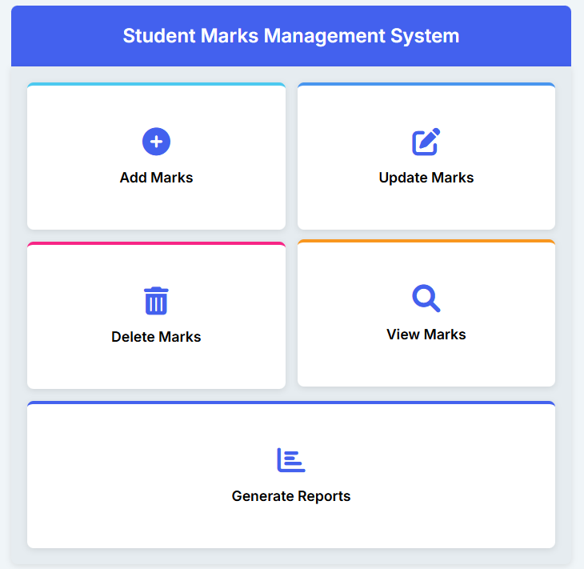
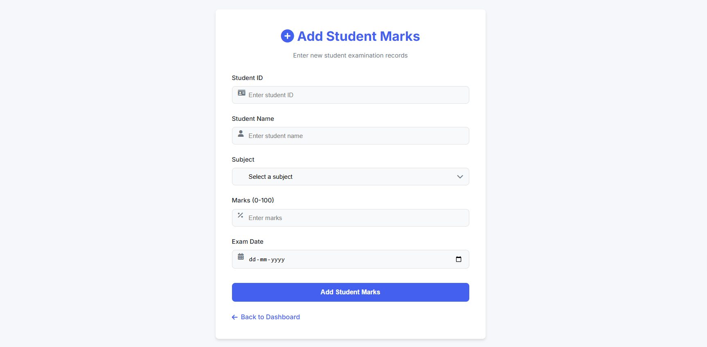
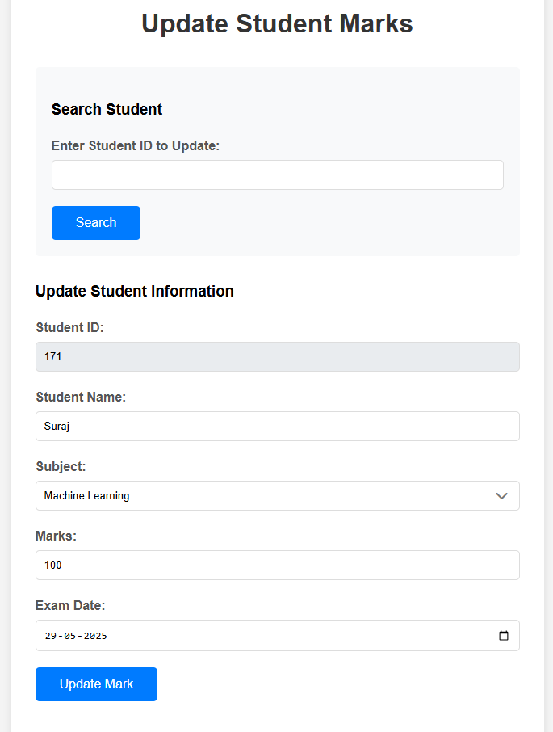
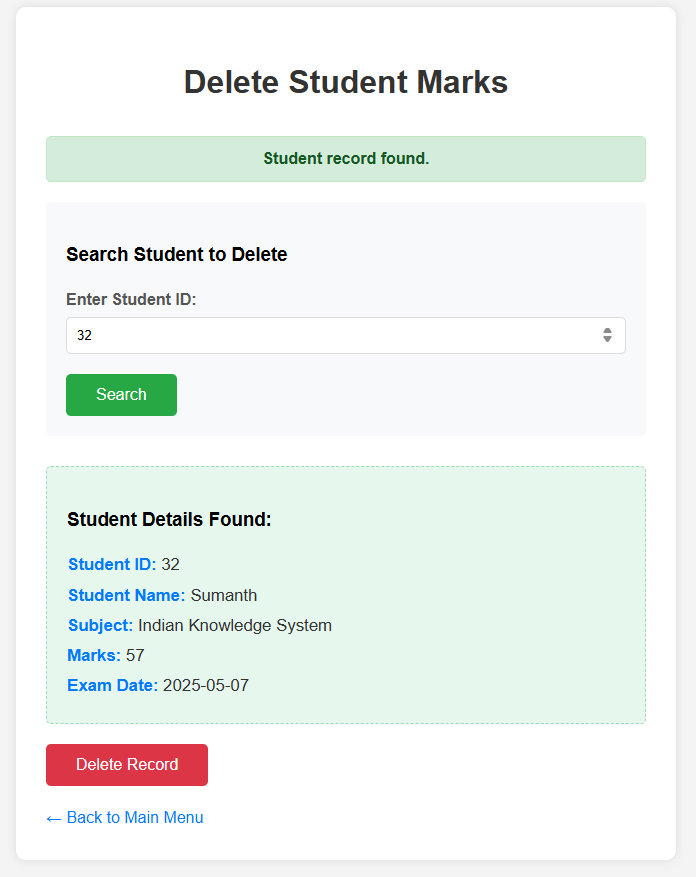
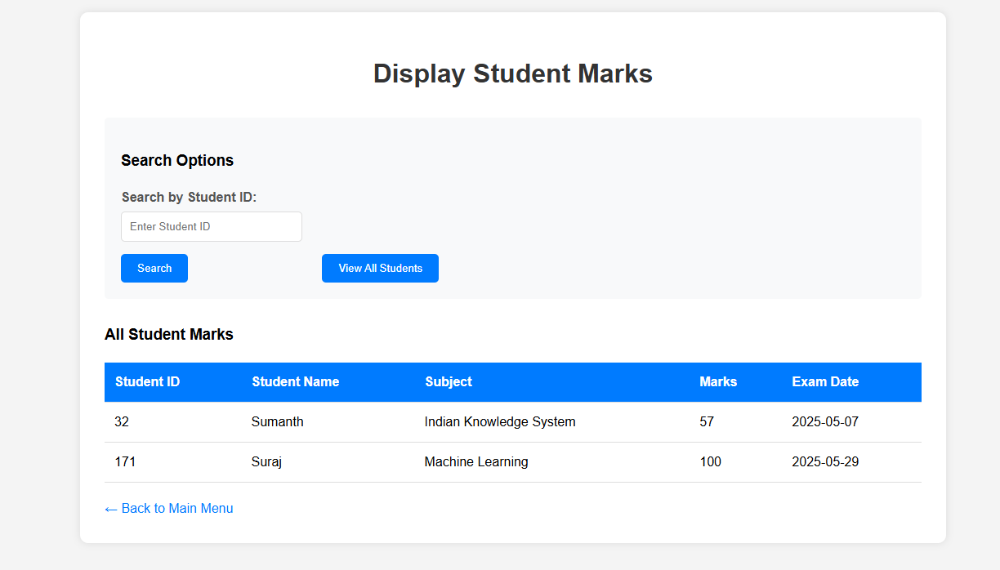
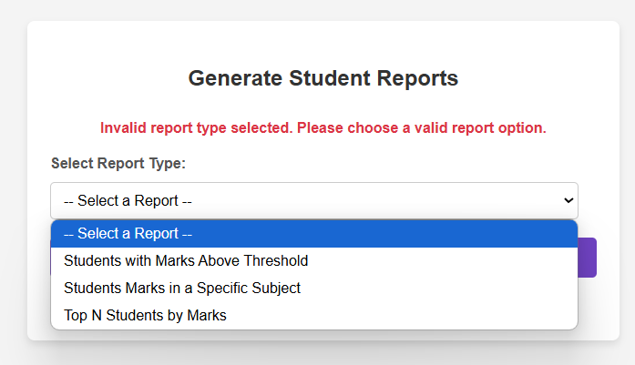

# Mark_Management_System

**Subject Name**: Advanced Java

**Subject Code**: BCS613D

**Name**: Suraj

**USN**: 4AL22CS171

**Sem/Section**: VI / C

---
A web-based system developed using JSP, Servlets, and MySQL, following the MVC architecture. It provides an efficient and user-friendly platform to manage student marks, generate reports, and maintain academic records.

## 🚀 Key Features

**Full CRUD Functionality**: Add, update, delete, and view student marks

**Search Functionality**: Find student records via Student ID

**Dynamic Reports**:

Students scoring above a specified mark

Students filtered by subject

Top-N performing students

## 📋 Prerequisites
-**java Development Kit (JDK)**

-**Apache Tomcat Server – Version 9.0**

-**MySQL Server (or XAMPP with MySQL support)**

-**MySQL JDBC Driver (mysql-connector-java)**

-**Integrated Development Environment (IDE)**

-**Modern Web Browser**:Chrome

## 📦 Project Structure

```

MarkWebApp/
├── src/
│   ├── dao/
│   │   └── MarkDAO.java
│   ├── model/
│   │   └── StudentMark.java
│   └── servlet/
│       ├── AddMarkServlet.java
│       ├── UpdateMarkServlet.java
│       ├── DeleteMarkServlet.java
│       ├── DisplayMarksServlet.java
│       ├── ReportServlet.java
│       └── ReportCriteriaServlet.java
├── WebContent/
│   ├── index.jsp
│   ├── markadd.jsp
│   ├── markupdate.jsp
│   ├── markdelete.jsp
│   ├── markdisplay.jsp
│   ├── reports.jsp
│   ├── report_form.jsp
│   └── report_result.jsp
├── WEB-INF/
│   └── web.xml
└── README.md

```

## 🗄️ Database Configuration
### Step 1: Create Database

```sql
CREATE DATABASE IF NOT EXISTS mark_management;
USE mark_management;

```
### Step 2: Create Table
```sql
CREATE TABLE StudentMarks (
StudentID INT PRIMARY KEY,
StudentName VARCHAR(100),
Subject VARCHAR(50),
Marks INT,
ExamDate DATE
);
```
###Step 3: Insert Sample Data

```sql
INSERT INTO StudentMarks VALUES
(171, 'Suraj', 'Cloud_Computing', 76, '2023-04-18'),
(176, 'Sumanth', 'Machine_Learing', 81, '2024-05-10'),
(183, 'Rathan', 'React', 85, '2021-04-25'),
```

## 🔧 Installation & Setup

### Step 1: Environment Setup

-JDK 8 or above

-Apache Tomcat 9+

-MySQL Server or XAMPP

-Eclipse / IntelliJ (J2EE IDE)

-MySQL Connector/J

### Step 2: Configure JDBC in MarkDAO.java
```java
connection = DriverManager.getConnection(
    "jdbc:mysql://localhost:3306/structure",
    "roote",
    ""
);
```
### Step 3: Deploy to Tomcat

Create a Dynamic Web Project in your IDE

Import files as per structure

Add MySQL connector to WEB-INF/lib

Start the server and visit:

```
http://localhost:8080/markmanagement/  
```

## 📸 Screenshots

### 🏠 Home Page



### ➕ Add Marks Page




### 🔍 Update Mark




### ❌ Delete Mark




### 🆕 Display Marks



### 📊 Generate Report




